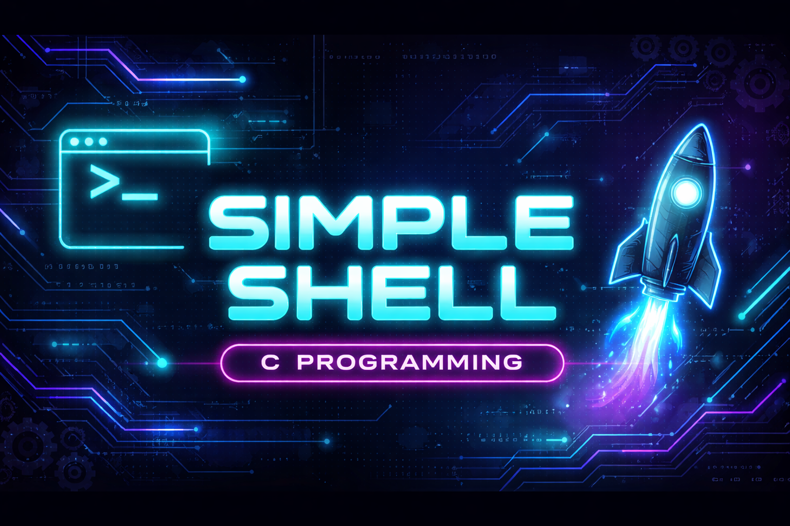

# Simple Shell Training 🐚

This repository is a **progressive training workspace** built while learning low-level programming concepts in C, leading step by step to the implementation of a **simple UNIX shell**.

It gathers **all preparatory exercises** related to processes, arguments, environment variables, PATH handling, and execution, as required before starting the Holberton *Simple Shell* project.

---

## 🎯 Objectives

The main goals of this repository are to:

- Understand **processes** and their lifecycle (PID / PPID)
- Manipulate **command-line arguments**
- Read user input safely
- Create and manage **child processes**
- Execute programs with `execve`
- Work with the **environment**
- Parse and use the **PATH**
- Re-implement core libc functions (`getenv`, `setenv`, `unsetenv`)
- Gradually assemble the foundations of a **minimal shell**

---

## 📁 Repository Structure

The repository contains:
- **Standalone exercises** (single C files)
- **Utility functions** reused across exercises
- **Multiple shell versions**, each one adding new features

### Root-level exercises
These files correspond directly to the training exercises:

| File | Description |
|-----|-------------|
| `pid`, `ppid` | Print process ID / parent process ID |
| `pid_max` | Read maximum PID value |
| `av` | Print arguments without using `ac` |
| `read_line` | Prompt and read user input using `getline` |
| `strtok` | Split a string into tokens |
| `ls_tmp_fork` | Fork + exec example |
| `printenv` / `print_env` | Print environment |
| `print_environ` | Use `environ` global variable |
| `_getenv` | Custom implementation of `getenv` |
| `_setenv` | Custom implementation of `setenv` |
| `_unsetenv` | Custom implementation of `unsetenv` |
| `_which` | Find executables in PATH |
| `print_path` | Display PATH directories |
| `path_linked_list` | Build a linked list from PATH |

---

## 🧠 Concepts Covered

### 1️⃣ Processes (PID & PPID)
- `getpid()` retrieves the current process ID
- `getppid()` retrieves the parent process ID
- Demonstrates process creation and hierarchy

### 2️⃣ Arguments Handling
- Understanding `int main(int ac, char **av)`
- Traversing arguments without using `ac`

### 3️⃣ Reading Input
- Prompting the user (`"$ "`)
- Reading input using `getline`
- Handling `EOF` (Ctrl+D)

### 4️⃣ Tokenization
- Splitting input into arguments
- Using `strtok`
- Preparing input for execution

### 5️⃣ Process Creation
- Creating child processes with `fork`
- Differentiating parent vs child using return value
- Synchronizing processes using `wait`

### 6️⃣ Program Execution
- Executing binaries using `execve`
- Replacing process memory
- Handling execution errors

### 7️⃣ Environment
- Understanding environment inheritance
- Accessing environment via:
  - `env` parameter of `main`
  - `environ` global variable
- Printing and comparing environment pointers

### 8️⃣ PATH Handling
- Parsing PATH directories
- Searching executables in PATH
- Building a linked list of PATH entries

### 9️⃣ Environment Variables
- Custom implementations of:
  - `_getenv`
  - `_setenv`
  - `_unsetenv`
- Working without libc helpers

---

## 🐚 Shell Versions

The `simple_shell_v*` directories show **incremental shell implementations**:

| Version | Features |
|------|----------|
| `simple_shell_v_00.1` | Process basics (PID / PPID) |
| `simple_shell_v_00.2` | Early shell structure |
| `simple_shell_v1` | Minimal shell loop |
| `simple_shell_v2` | PATH handling |
| `simple_shell_v3` | Environment integration |
| `simple_shell_v4` | Refined execution logic |
| `simple_shell_V5` | Modular structure |
| `simple_shell_v6` | Builtins, handlers, final prep |

Each version reflects **learning progression**, not duplication.

---

## ⚙️ Compilation

All programs are compiled using:

`gcc -Wall -Wextra -Werror -pedantic *.c -o program_name`

## 🧪 Usage Example

Shell versions are compiled and executed from their respective directories.

`$ ./shell`
`#cisfun$ /bin/ls`
`#cisfun$ ./ppid`
`#cisfun$ ^C`

## 📚 Learning Context

This repository is part of the **Holberton School low-level programming curriculum** and strictly follows:

- POSIX system calls  
- Manual memory management  
- Betty coding style (where applicable)  
- Progressive, test-driven learning  

---

## 🚀 Next Step

This repository serves as the **foundation** for the official `simple_shell` project.

All code and concepts developed here will be **reused, refactored, and extended** in the final shell implementation.

## 👤 Author

- **Gwenaëlle Pichot**  
  Holberton School – Low-level Programming  
  GitHub: [gpichot](https://github.com/gpichot)

